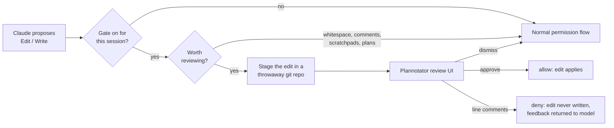

# plannotator-review-gate

Review every edit Claude Code proposes — in a real diff UI, before it touches your disk.

Claude Code's built-in permission prompt asks *"allow this edit?"* with a preview you
can't comment on. This hook replaces that moment with a full code review: the proposed
change opens in [Plannotator](https://github.com/backnotprop/plannotator)'s review UI as
a side-by-side diff. Approve it and the edit applies. Leave line comments and the edit is
**denied** — never written — and your feedback goes back to the model, which revises and
proposes again.

It's opt-in **per session**, so one terminal can review every edit while another works
unimpeded.



## Requirements

- **[Plannotator](https://github.com/backnotprop/plannotator)** on your `PATH` or at
  `~/.local/bin/plannotator`. This gate drives its `review` command.
- **git** — the proposed edit is staged in a temporary repo so Plannotator has a real
  diff to render.
- macOS or Linux.

## Install

Download a binary from [releases](https://github.com/TheOutdoorProgrammer/plannotator-review-gate/releases),
or:

```bash
go install github.com/TheOutdoorProgrammer/plannotator-review-gate@latest
```

From source:

```bash
git clone https://github.com/TheOutdoorProgrammer/plannotator-review-gate
cd plannotator-review-gate
make install          # vets, tests, installs to ~/bin
```

## Setup

**1. Wire it as a PreToolUse hook.** The binary prints its own config:

```bash
plannotator-review-gate hook-config
```

Add the printed entry to `hooks` in `~/.claude/settings.json`. Multiple hooks per event
compose, so append to an existing `PreToolUse` array rather than replacing it:

```json
{
  "hooks": {
    "PreToolUse": [
      {
        "matcher": "Edit|Write|MultiEdit",
        "hooks": [
          {
            "type": "command",
            "command": "/Users/you/bin/plannotator-review-gate",
            "timeout": 345600
          }
        ]
      }
    ]
  }
}
```

> **Don't lower the timeout.** It's how long Claude Code waits for the hook, and therefore
> how long you have to finish a review. The default (345600s ≈ 4 days) means "as long as
> you need." Lower it and long reviews get cut off mid-thought.

**2. Install the slash command** so you can toggle the gate from inside Claude Code:

```bash
mkdir -p ~/.claude/commands
curl -fsSL https://raw.githubusercontent.com/TheOutdoorProgrammer/plannotator-review-gate/main/commands/review-gate.md \
  -o ~/.claude/commands/review-gate.md
```

If you cloned the repo, symlink it instead so it tracks `git pull`:

```bash
ln -s "$PWD/commands/review-gate.md" ~/.claude/commands/review-gate.md
```

(The release tarballs ship it as well. `go install` gives you only the binary, which is
why the curl is the default.)

The command file also carries the rules the agent needs to follow when it gets denied —
worth installing even if you prefer toggling from a shell.

**3. Restart Claude Code** so it picks up the new hook.

## Usage

Inside a Claude Code session:

```text
/review-gate on               # review every edit from here on
/review-gate on --skip-tests  # ...except test files
/review-gate status
/review-gate off
```

Or from a shell inside that session:

```bash
plannotator-review-gate on
plannotator-review-gate toggle
```

The toggle takes effect on the **very next edit** — no restart. State is keyed off
`CLAUDE_CODE_SESSION_ID`, so enabling it in one session leaves every other session
alone. Flags live in `~/.claude/plannotator-review-gate.sessions/` and stale ones are
swept after 7 days.

### Narrating an edit

The agent can explain a change *inside the review*, pinned to the line it's about, so you read a narrated diff instead of reverse-engineering intent:

```bash
plannotator-review-gate note internal/model/model.go --line 42-44 \
  "dropped the backticks — the tag parser treats them as a delimiter"
plannotator-review-gate note internal/model/model.go --type concern \
  "not sure this handles the empty case"
```

Queue notes *before* the edit; the gate posts them when that edit comes up for review and drops them once shown.
`--line N` or `--line N-M` pins to a line, no `--line` posts a review-level comment, and `--type` is `comment` (default), `suggestion`, or `concern`.
Notes are per session (`CLAUDE_CODE_SESSION_ID`), queued in `~/.claude/plannotator-review-gate.notes/`, and swept after 7 days.

Two things worth knowing about why it works this way:

- **The agent cannot post these itself.** Plannotator's annotation API is open to any local tool, but the hook blocks the edit tool call for the review's whole life, so the agent is never running while the review is on screen. The gate has to post for it.
- **A posted note is stripped back out of the verdict.** Plannotator merges external annotations into your own set and exports them with no source marker, so an unstripped note would come back to the agent as *your* feedback and deny the edit it was explaining. Editing a note is your way of adopting it — an edited note stops matching and does reach the agent as feedback.

Posting is best-effort and never fails an edit: if the review can't be found or the post fails, you get a line on stderr and the review proceeds as normal.

### What it skips

Review fatigue kills the habit, so the gate stays out of the way for changes that aren't
worth a diff:

| Skipped | Why |
| --- | --- |
| Whitespace and blank-line churn | Any file type. A real re-indent (meaningful in Python/YAML) still gates. |
| Comment-only edits | Existing files, [known languages](comments.go). Reworded a comment? Not a review. |
| Agent memory, scratchpads, plan files | Claude's own artifacts, not your project's code. |
| Test files (with `--skip-tests`) | Matched by naming convention — `*_test.go`, `test_*.py`, `*.spec.ts`, `*Test.java`, `__tests__/`. |
| No-op writes | Content identical to what's on disk. |

Comment detection errs toward finding *fewer* comments: a miss costs you one extra
review, but a false positive would let real code through unreviewed.

### When the gate breaks, it fails closed

If the gate can't stage the edit or can't launch Plannotator, it **denies** the edit
rather than quietly applying it. An unreviewed edit landing while you believe everything
is reviewed is worse than a stuck session.

The denial names the cause and explicitly tells the model **not** to retry it, work
around it by writing the file some other way, or turn the gate off. Fixing a broken gate
is your call, not the agent's.

The one exception is a crash *in this program* on a session with the gate off — that
exits 0 and lets the edit follow the normal permission flow, because a bug here should
never wedge a session that never asked for review.

## cmux integration (inert — cmux is retired)

⚠️ **This does nothing on a machine without `cmux`** — which now includes the machine it was written on.
cmux was retired in favour of muxy and the indicator was never ported, so in practice the gate paints no tab at all.
It is documented here only because the code path is still present and harmless — treat the rest of this section as history until someone ports `sidebar.go`.

If you use [cmux](https://github.com/manaflow-ai/cmux), enabling the gate puts a 🔒 on
the current workspace tab so you can see at a glance which sessions are gated. It's
best-effort and a silent no-op everywhere else — nothing to configure either way.

The first toggle on a machine without cmux writes `~/.claude/plannotator-review-gate.no-sidebar`
and stops probing for it. Two things follow from that:

- **Installed cmux later?** Delete that file and the indicator comes back.
- **Want it off even with cmux installed?** Create the file yourself. That's the opt-out.

Only a missing `cmux` binary is remembered. If cmux is installed but the toggle runs
outside a cmux session (plain terminal, ssh, CI), nothing is cached — that's temporary,
and caching it would disable the indicator inside cmux too.

One honest limitation: the lock is a property of the *workspace tab*, while the gate is
per *session*. Run two Claude Code sessions in one cmux workspace and the tab reflects
whichever toggled last, so it can show a lock while one of them is ungated. Trust
`plannotator-review-gate status`, not the tab, when it matters.

## Troubleshooting

**"plannotator binary not found"** — the hook runs with a minimal `PATH`. Either put
`plannotator` in `~/.local/bin` (checked directly) or use an absolute path.

**The review UI opens twice per edit** — you have both this gate and a separate
Plannotator edit-hook wired in `settings.json`. Keep one.

**Reviews get cut off** — your `settings.json` hook `timeout` is too low. See the note
in Setup.

**Nothing happens on edits** — check `plannotator-review-gate status` inside that
session. The gate is per-session and off by default.

## Development

```bash
make test    # go test -race
make vet
make build
```

Releases are tag-driven: pushing a `vX.Y.Z` tag runs the test suite and then GoReleaser
(see `.github/workflows/release.yml`).

## Credits

Built to pair with [Plannotator](https://github.com/backnotprop/plannotator) by
[@backnotprop](https://github.com/backnotprop), which does the actual review UI.

## License

MIT — see [LICENSE](LICENSE).
