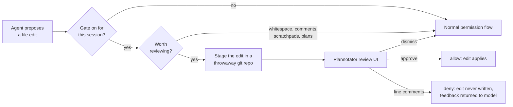

# plannotator-review-gate

Review edits proposed by Claude Code, Codex, or Cursor in a real diff UI before
they touch your disk.

The built-in permission prompts offer limited review context. This hook replaces
that moment with a full code review: the proposed change opens in
[Plannotator](https://github.com/backnotprop/plannotator)'s review UI as a
side-by-side diff. Approve it and the edit applies. Leave line comments and the
edit is **denied**, never written, and your feedback goes back to the model.

It's opt-in **per session**, so one terminal can review every edit while another works
unimpeded.



## Requirements

- **[Plannotator](https://github.com/backnotprop/plannotator)** on your `PATH` or at
  `~/.local/bin/plannotator`. This gate drives its `review` command.
- **git** — the proposed edit is staged in a temporary repo so Plannotator has a real
  diff to render.
- macOS or Linux.

## Install

Download a binary from [releases](https://github.com/TheOutdoorProgrammer/plannotator-review-gate/releases),
or:

```bash
go install github.com/TheOutdoorProgrammer/plannotator-review-gate@latest
```

From source:

```bash
git clone https://github.com/TheOutdoorProgrammer/plannotator-review-gate
cd plannotator-review-gate
make install          # vets, tests, installs to ~/bin
```

## Setup

**1. Wire it as a PreToolUse hook.** The binary prints host-specific config:

```bash
plannotator-review-gate hook-config claude
plannotator-review-gate hook-config codex
plannotator-review-gate hook-config cursor
```

Merge each entry into the corresponding file:

| Host | Configuration |
| --- | --- |
| Claude Code | `~/.claude/settings.json` under `hooks` |
| Codex | `~/.codex/hooks.json` |
| Cursor | `~/.cursor/hooks.json` |

Multiple hooks per event compose, so append entries rather than replacing
existing hooks. Claude configuration looks like this:

```json
{
  "hooks": {
    "PreToolUse": [
      {
        "matcher": "Edit|Write|MultiEdit",
        "hooks": [
          {
            "type": "command",
            "command": "/Users/you/bin/plannotator-review-gate hook claude",
            "timeout": 345600
          }
        ]
      }
    ]
  }
}
```

> **Don't lower the timeout.** It is how long the host waits for the hook and
> therefore how long you have to finish a review. The default (345600s, about
> four days) means "as long as you need." Lower it and long reviews get cut off.

**2. Install the command** so you can toggle the gate from inside each host:

```bash
mkdir -p ~/.claude/commands ~/.cursor/commands ~/.codex/prompts
for target in \
  ~/.claude/commands/review-gate.md \
  ~/.cursor/commands/review-gate.md \
  ~/.codex/prompts/review-gate.md
do
  curl -fsSL https://raw.githubusercontent.com/TheOutdoorProgrammer/plannotator-review-gate/main/commands/review-gate.md \
    -o "$target"
done
```

If you cloned the repo, symlink it instead so it tracks `git pull`:

```bash
ln -s "$PWD/commands/review-gate.md" ~/.claude/commands/review-gate.md
ln -s "$PWD/commands/review-gate.md" ~/.cursor/commands/review-gate.md
ln -s "$PWD/commands/review-gate.md" ~/.codex/prompts/review-gate.md
```

Claude Code and Cursor expose this as `/review-gate`. Codex custom prompts are
namespaced, so use `/prompts:review-gate`. Codex has deprecated custom prompts
in favor of skills, but prompts remain the only way to retain slash-command
arguments such as `on --skip-tests`.

The command file also carries the rules the agent needs to follow when it gets
denied, so it is worth installing even if you prefer toggling from a shell.

**3. Restart the agents** so they pick up the new hooks. In Codex, inspect and
trust the new hook when `/hooks` prompts you.

## Usage

Inside Claude Code or Cursor:

```text
/review-gate on               # review every edit from here on
/review-gate on --skip-tests  # ...except test files
/review-gate status
/review-gate off
```

Inside Codex, use the namespaced equivalent:

```text
/prompts:review-gate on
```

Or from a shell launched inside that agent session:

```bash
plannotator-review-gate on
plannotator-review-gate toggle
```

The toggle takes effect on the **very next edit**, with no restart. State is
keyed by the host's session identifier, so enabling it in one session leaves
every other session alone. Flags live in
`~/.claude/plannotator-review-gate.sessions/` for backward compatibility and
stale ones are swept after seven days.

### Narrating an edit

The agent can explain a change *inside the review*, pinned to the line it's about, so you read a narrated diff instead of reverse-engineering intent:

```bash
plannotator-review-gate note internal/model/model.go --line 42-44 \
  "dropped the backticks — the tag parser treats them as a delimiter"
plannotator-review-gate note internal/model/model.go --type concern \
  "not sure this handles the empty case"
```

Queue notes *before* the edit; the gate posts them when that edit comes up for review and drops them once shown.
`--line N` or `--line N-M` pins to a line, no `--line` posts a review-level comment, and `--type` is `comment` (default), `suggestion`, or `concern`.
Notes are per agent session, queued in
`~/.claude/plannotator-review-gate.notes/`, and swept after seven days.

**The queue pushes back on notes that aren't pinned.** Narration is worth reading only next to the code it explains, but notes are queued *before* the edit exists — so pinning means working out the post-edit line number, and the cheap way out is to park everything on line 1. Two guards make that the expensive option:

| Rejected | Why |
| --- | --- |
| An unpinned note (no `--line`, or `--line 1`) over 3 lines or 400 characters | A wall of text with nowhere to be. Split it into one note per line. |
| A *second* unpinned note for the same file | The pile-on-one-spot pattern. Pin it, or fold it into the first. |

Both exit 64 and name the fix, so the agent retries with the note placed instead of retrying the same shape. A long note on a real line is left alone: pinning already took the work the guards exist to force. Thresholds are constants in [`notes.go`](notes.go).

Two things worth knowing about why it works this way:

- **The agent cannot post these itself.** Plannotator's annotation API is open to any local tool, but the hook blocks the edit tool call for the review's whole life, so the agent is never running while the review is on screen. The gate has to post for it.
- **A posted note is stripped back out of the verdict.** Plannotator merges external annotations into your own set and exports them with no source marker, so an unstripped note would come back to the agent as *your* feedback and deny the edit it was explaining. Editing a note is your way of adopting it — an edited note stops matching and does reach the agent as feedback.

Posting is best-effort and never fails an edit: if the review can't be found or the post fails, you get a line on stderr and the review proceeds as normal.

### What it skips

Review fatigue kills the habit, so the gate stays out of the way for changes that aren't
worth a diff:

| Skipped | Why |
| --- | --- |
| Whitespace and blank-line churn | Any file type. A real re-indent (meaningful in Python/YAML) still gates. |
| Comment-only edits | Existing files, [known languages](comments.go). Reworded a comment? Not a review. |
| Agent memory, scratchpads, plan files | Claude's own artifacts, not your project's code. |
| Test files (with `--skip-tests`) | Matched by naming convention — `*_test.go`, `test_*.py`, `*.spec.ts`, `*Test.java`, `__tests__/`. |
| No-op writes | Content identical to what's on disk. |

Comment detection errs toward finding *fewer* comments: a miss costs you one extra
review, but a false positive would let real code through unreviewed.

### When the gate breaks, it fails closed

If the gate can't stage the edit or can't launch Plannotator, it **denies** the edit
rather than quietly applying it. An unreviewed edit landing while you believe everything
is reviewed is worse than a stuck session.

The denial names the cause and explicitly tells the model **not** to retry it, work
around it by writing the file some other way, or turn the gate off. Fixing a broken gate
is your call, not the agent's.

The one exception is a crash *in this program* on a session with the gate off — that
exits 0 and lets the edit follow the normal permission flow, because a bug here should
never wedge a session that never asked for review.

## cmux integration

The retired cmux sidebar indicator is no longer called from the toggle path.
`plannotator-review-gate status` is the source of truth for the current session.

## Troubleshooting

**"plannotator binary not found"** — the hook runs with a minimal `PATH`. Either put
`plannotator` in `~/.local/bin` (checked directly) or use an absolute path.

**The review UI opens more than once per edit** — update the gate. Current host
adapters reject compatibility payloads imported from another agent's hook
configuration, and duplicate Cursor registrations coordinate on `tool_use_id`
so they share one review and one verdict. Also check for a separate Plannotator
edit hook.

**Reviews get cut off** — the host hook `timeout` is too low. See the note in
Setup.

**Nothing happens on edits** — check `plannotator-review-gate status` inside that
session. The gate is per-session and off by default.

## Development

```bash
make test    # go test -race
make vet
make build
```

Releases are tag-driven: pushing a `vX.Y.Z` tag runs the test suite and then GoReleaser
(see `.github/workflows/release.yml`).

## Credits

Built to pair with [Plannotator](https://github.com/backnotprop/plannotator) by
[@backnotprop](https://github.com/backnotprop), which does the actual review UI.

## License

MIT — see [LICENSE](LICENSE).
